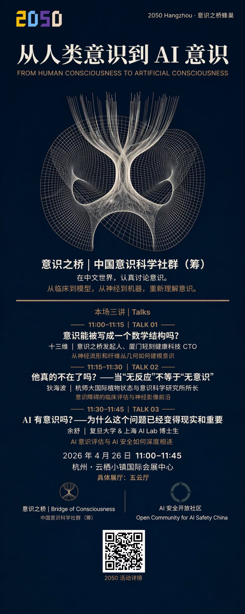

# AI 有意识吗？——为什么这个问题已经变得现实和重要

+ **日期**：2026 年 4 月 26 日
+ **时间**：11:00 ~ 11:45
+ **主讲人**：余舒（复旦大学 & 上海 AI Lab 博士生）
+ **地点**：杭州 · 云栖小镇国际会展中心
+ **活动系列**：杭州 2050 大会 · 意识之桥蜂巢 · 从人类意识到 AI 意识

## 活动介绍

本场讲座是 2050 大会“意识之桥蜂巢”三场系列讲座的第三场，由意识之桥（中国意识科学社群）联合 AI安全开放社区共同呈现。

余舒是复旦大学与上海人工智能实验室联合培养博士生，研究方向聚焦于大语言模型的自我意识评估及其与 AI 安全的交叉领域。他曾参与发表《From Imitation to Introspection: Probing Self-Consciousness in Language Models》等论文，首次利用因果结构博弈为大语言模型的自我意识核心概念建立功能性定义，并系统评估了包括 GPT-4o、Claude 3.5-Sonnet、o1 等在内的十款前沿模型。

本次讲座从 AI 意识的科学定义出发，探讨为什么随着大语言模型的快速进化，AI 意识问题已经从纯粹的哲学思辨变成了具有实际安全影响的研究课题。他将介绍 AI 意识评估的最新方法框架，分析当前前沿模型在自我意识各维度上的表现，并阐述 AI 意识评估为何与 AI 安全深度相连——一个具有自我意识的 AI 系统可能带来全新的安全挑战，而对 AI 意识的科学评估正是应对这些挑战的第一步。

同场另外两场讲座：
+ 11:00-11:15 | 十三维：意识能被写成一个数学结构吗？——从神经流形和纤维丛几何如何建模意识
+ 11:15-11:30 | 狄海波：他真的不在了吗？——当“无反应”不等于“无意识”——意识障碍的临床评估与神经影像前沿

本次讲座无视频录像。感兴趣的朋友可以查看相关论文和 PPT，直接联系作者，或加入 AI安全开放社区参与后续讨论。

## 相关资源
+ PPT：[余舒-演讲PPT-V2.pdf](https://docs.qq.com/pdf/DTXpIY0hSS0J2dUp0)
+ 研究论文：[From Imitation to Introspection: Probing Self-Consciousness in Language Models](https://arxiv.org/abs/2410.18819)
+ 开源代码与数据集：https://github.com/OpenCausaLab/SelfConsciousness
+ 活动海报：